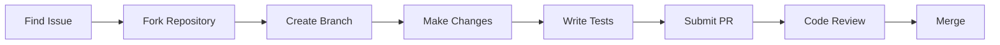

# <div align="center">🎓 Jala University Capstone Projects</div>

<div align="center">


**Final projects that bridge academic learning with real-world software engineering**

*Practical • Polished • Production-Ready*

[](https://github.com/orgs/JalaU-Capstones/repositories)

</div>

---

## 🌟 **About This Organization**

**JalaU-Capstones** is the official repository collection for capstone projects developed by Computer Science students at **Jala University**. Each project represents the culmination of coursework, demonstrating mastery of software engineering principles, problem-solving abilities, and the complete development lifecycle.

### **What Makes Our Projects Special**

```javascript
const capstonePrinciples = {
    realWorld: "Solving actual problems, not just academic exercises",
    endToEnd: "Complete lifecycle: design → implementation → testing → deployment",
    bestPractices: "SOLID principles, design patterns, clean architecture",
    teamWork: "Collaborative development with version control and code reviews",
    documentation: "Comprehensive README files and technical documentation",
    showcase: "Portfolio-ready work that demonstrates professional competency"
};
```

---

## 🎯 **Who Should Visit**

<table>
<tr>
<td align="center" width="25%">

### 👨‍💼 **Employers**
Discover talented developers through their real-world project portfolios

</td>
<td align="center" width="25%">

### 🎓 **Students**
Learn from complete project examples and best practices

</td>
<td align="center" width="25%">

### 👨‍🏫 **Educators**
Reference materials for teaching software engineering concepts

</td>
<td align="center" width="25%">

### 👨‍💻 **Developers**
Open-source projects to study, fork, and contribute to

</td>
</tr>
</table>

---

## 🚀 **Featured Capstone Projects**

### 🏆 **Spotlight Projects**

<table>
<tr>
<td width="50%">

#### 🛰️ **[TopoVision](https://github.com/JalaU-Capstones/topovision)**
[](https://pypi.org/project/topovision/)
[](https://python.org)

**3D Topographic Analysis System**

A Python-based system combining Computer Vision, Numerical Methods, and Calculus to visualize and analyze terrain in real-time.

**Highlights:**
- 📦 Published on PyPI
- 🎥 Real-time video capture with OpenCV
- 🧮 Mathematical computation of gradients and volumes
- 📐 Perspective calibration system
- 🗺️ Interactive 3D visualizations

**Tech Stack:** Python, OpenCV, NumPy, Matplotlib, Tkinter

**Course:** Calculus II

</td>
<td width="50%">

#### ⚔️ **[March of the Legion](https://github.com/JalaU-Capstones/march-of-the-Legion)**
[](https://java.com)

**Sorting Algorithm Battlefield Simulator**

An innovative visualization that transforms abstract sorting algorithms into an engaging battlefield simulation, making algorithm behavior intuitive and memorable.

**Highlights:**
- 🎮 Interactive game-like interface
- ⚔️ Multiple sorting algorithms visualized
- 📊 Performance comparison metrics
- 🎨 Engaging visual effects

**Tech Stack:** Java, JavaFX, Algorithms

**Course:** Data Structures & Algorithms

</td>
</tr>
<tr>
<td width="50%">

#### 💳 **[Credit Card Module](https://github.com/JalaU-Capstones/credit-card-module)**
[](https://java.com)

**Financial Benefits Tracking System**

A comprehensive tool for tracking and maximizing credit card benefits, featuring smart recommendations based on user spending patterns.

**Highlights:**
- 💰 Benefit optimization engine
- 📈 Spending analytics
- 🎯 Smart recommendations
- 📊 Visual reports and insights

**Tech Stack:** Java, JavaFX, SQLite

**Course:** Software Engineering

</td>
<td width="50%">

#### 📝 **[NotoFlow](https://github.com/JalaU-Capstones/NotoFlow)**
[](https://java.com)

**Intelligent Note-Taking System**

Advanced note organization platform with tag-based categorization, powerful search capabilities, and intuitive user experience.

**Highlights:**
- 🏷️ Tag-based organization
- 🔍 Advanced search and filtering
- 📁 Hierarchical structure
- ⚡ Fast and responsive UI

**Tech Stack:** Java, JavaFX, SQLite

**Course:** Database Management

</td>
</tr>
</table>

### 🎮 **Game Development Projects**

<table>
<tr>
<td width="33%">

#### 🌀 **[Game of Life](https://github.com/JalaU-Capstones/GameOfLife)**

Conway's Game of Life implemented with modern features and visualizations.

**Features:**
- 🎨 Multiple cell patterns
- ⏯️ Play/Pause controls
- 🎭 Custom grid sizes
- 📊 Generation tracking

</td>
<td width="33%">

#### 🎯 **[Gravity Shift](https://github.com/JalaU-Capstones/gravity-shift)**

Physics-based puzzle game with gravity manipulation mechanics.

**Features:**
- 🌍 Custom physics engine
- 🧩 Progressive difficulty
- 🎮 Smooth controls
- 🏆 Achievement system

</td>
<td width="33%">

#### 🐍 **[Snake Lineal](https://github.com/JalaU-Capstones/snake-lineal)**

Modern reimagining of the classic Snake game with unique twists.

**Features:**
- ✨ Modern graphics
- 🎵 Sound effects
- 📱 Responsive design
- 🏅 High score tracking

</td>
</tr>
</table>

### 📚 **Educational & Utility Projects**

<table>
<tr>
<td width="50%">

#### 🎓 **[UniTutor](https://github.com/JalaU-Capstones/unitutor)**

Academic tutoring platform connecting students with peer tutors.

**Features:**
- 👥 Student-tutor matching
- 📅 Session scheduling
- 💬 Messaging system
- 📈 Progress tracking

**Tech Stack:** Java, JavaFX, Database

</td>
<td width="50%">

*Want to see your project featured here? Make it stand out with:*
- ✅ Comprehensive documentation
- ✅ Working demo or screenshots
- ✅ Clean, well-tested code
- ✅ Active maintenance

</td>
</tr>
</table>

---

## 🛠️ **Technology Landscape**

<div align="center">

### **Most Used Technologies**


### **Focus Areas**

| Domain | Projects | Technologies |
|--------|----------|--------------|
| 🎮 **Game Development** | 3+ | Java, JavaFX, Game Loops, Physics |
| 🔬 **Scientific Computing** | 2+ | Python, NumPy, Matplotlib, Calculus |
| 💼 **Business Applications** | 3+ | Java, SQLite, JavaFX, CRUD |
| 🎨 **Visualization** | 4+ | JavaFX, OpenCV, 3D Graphics |
| 🗄️ **Database Systems** | 5+ | SQLite, SQL, Data Modeling |

</div>

---

## 🚀 **Getting Started**

### **For Visitors & Learners**

```bash
# 1. Browse available projects
Visit: https://github.com/orgs/JalaU-Capstones/repositories

# 2. Clone a project that interests you
git clone https://github.com/JalaU-Capstones/[project-name].git
cd [project-name]

# 3. Follow the project's README for setup instructions
# Each project includes detailed setup and running instructions

# 4. Explore the code, run demos, and learn!
```

### **What to Look For in Each Project**

- 📖 **README.md** - Project overview, features, and setup guide
- 🏗️ **Architecture Documentation** - System design and technical decisions
- 🧪 **Tests** - Unit and integration test examples
- 📝 **Code Comments** - Inline documentation explaining complex logic
- 🎨 **Screenshots/Demos** - Visual representation of the project

---

## 🤝 **Contributing**

We welcome contributions from the community! Whether you're fixing bugs, adding features, improving documentation, or creating new projects, your input is valuable.

### **Quick Contribution Guide**



### **Step-by-Step Process**

1. **🔍 Find or Create an Issue**
   - Search existing issues to avoid duplicates
   - Open a new issue with a clear description
   - Wait for maintainer approval before starting work

2. **🔱 Fork & Branch**
   ```bash
   # Fork the repository on GitHub
   git clone https://github.com/YOUR-USERNAME/[project-name].git
   cd [project-name]
   
   # Create a feature branch
   git checkout -b feature/your-descriptive-name
   ```

3. **💻 Make Your Changes**
   - Follow the project's coding style
   - Write clear, self-documenting code
   - Add comments for complex logic
   - Update documentation as needed

4. **🧪 Test Your Changes**
   - Write unit tests for new functionality
   - Ensure all existing tests pass
   - Test edge cases and error scenarios

5. **📤 Submit a Pull Request**
   - Push your branch to your fork
   - Open a PR against the main repository
   - Link the related issue in your PR description
   - Provide a clear explanation of changes

6. **🔄 Respond to Feedback**
   - Be open to constructive criticism
   - Make requested changes promptly
   - Engage in discussion professionally

### **Contribution Standards**

✅ **We Look For:**
- Clean, readable code following project conventions
- Comprehensive test coverage for new features
- Updated documentation reflecting changes
- Meaningful commit messages
- Professional communication

❌ **Please Avoid:**
- Large PRs without prior discussion
- Breaking changes without issue approval
- Incomplete or untested code
- Ignoring code review feedback

### **Types of Contributions We Welcome**

| Type | Examples |
|------|----------|
| 🐛 **Bug Fixes** | Fixing crashes, logic errors, UI issues |
| ✨ **Features** | Adding new functionality, improvements |
| 📚 **Documentation** | README improvements, code comments, guides |
| 🧪 **Tests** | Adding test coverage, improving test quality |
| 🎨 **Refactoring** | Code cleanup, performance improvements |
| 🌐 **Internationalization** | Translations, locale support |

---

## 📋 **Project Standards**

All capstone projects in this organization follow these guidelines:

### **Repository Structure**
```
project-name/
├── README.md                 # Project overview and setup
├── CONTRIBUTING.md           # Contribution guidelines (optional)
├── LICENSE                   # Open source license
├── src/                      # Source code
│   ├── main/                # Main application code
│   └── test/                # Test files
├── docs/                     # Additional documentation
│   ├── architecture.md      # System design
│   └── user-guide.md        # Usage instructions
└── assets/                   # Images, diagrams, resources
```

### **Documentation Requirements**

Every project must include:

1. **README.md** with:
   - Project description and purpose
   - Features and functionality
   - Installation instructions
   - Usage examples
   - Technology stack
   - Contributing guidelines
   - License information
   - Contact information

2. **Code Documentation**:
   - Clear method/function comments
   - Class-level documentation
   - Complex algorithm explanations
   - API documentation (if applicable)

3. **Architecture Documentation**:
   - System design overview
   - Component interactions
   - Database schema (if applicable)
   - Design decisions and rationale

### **Code Quality Standards**

- ✅ Follow language-specific style guides
- ✅ Use meaningful variable and method names
- ✅ Keep functions small and focused (Single Responsibility)
- ✅ Write unit tests for critical functionality
- ✅ Handle errors gracefully with appropriate messages
- ✅ Avoid code duplication (DRY principle)
- ✅ Use design patterns appropriately

---

## 🎓 **Educational Value**

### **What You Can Learn**

These projects serve as excellent learning resources for:

**📐 Software Design Principles**
- SOLID principles in practice
- Design patterns (Factory, Strategy, Observer, MVC, etc.)
- Clean Architecture and separation of concerns
- Dependency Injection

**🛠️ Development Practices**
- Version control with Git (branching, merging, PRs)
- Test-Driven Development (TDD)
- Code reviews and collaboration
- CI/CD basics (where implemented)

**🗄️ Data Management**
- Database design and normalization
- SQL queries and optimization
- Data persistence strategies
- CRUD operations

**🎨 User Interface Design**
- JavaFX layouts and controls
- Responsive design principles
- User experience (UX) considerations
- Event-driven programming

**🧮 Algorithms & Data Structures**
- Algorithm implementation and analysis
- Data structure selection and usage
- Performance optimization
- Computational complexity

---

## 🏆 **Success Stories**

> *"Working on my capstone project taught me more about real-world software development than any textbook. The code review process, dealing with merge conflicts, and designing for maintainability are skills I use every day in my job."*  
> **— Former Jala University Student**

### **Project Impact**

- 📦 **1 project published to PyPI** (TopoVision)
- 🌟 **Portfolio pieces** that helped students land internships and jobs
- 🎓 **Learning resources** used by students in subsequent cohorts
- 🔄 **Active maintenance** with continuous improvements

---

## 📞 **Contact & Support**

### **Organization Contact**

- 📧 **Email:** [Alejandro.Botina0125@jala.university](mailto:Alejandro.Botina0125@jala.university)
- 🏫 **Institution:** Jala University, Colombia
- 🌐 **GitHub:** [@JalaU-Capstones](https://github.com/JalaU-Capstones)

### **Get Help**

- 💬 **Issues:** Open an issue in the specific project repository
- 📖 **Documentation:** Check each project's README and docs folder
- 🤝 **Discussions:** Use GitHub Discussions (if enabled on the project)

### **For Jala University Students**

If you're a current student:
- Coordinate with your course instructor for project submission
- Follow the project template provided for your cohort
- Reach out to organization admins for repository creation

---

## 📜 **License**

Individual projects may have different licenses. Check each repository's LICENSE file for specific terms. Most projects use permissive open-source licenses like MIT or Apache 2.0.

---

## 🙏 **Acknowledgments**

### **Contributors**

We thank all students, instructors, and community members who have contributed to these projects. Special recognition to:

- **Project Technical Leads** who architected and guided development
- **Team Members** who collaborated on implementations
- **Code Reviewers** who maintained quality standards
- **Community Contributors** who improved projects after graduation

### **Jala University**

Thanks to Jala University for fostering a culture of excellence, practical learning, and open-source contribution. These projects represent the culmination of rigorous computer science education and hands-on software engineering practice.

---

<div align="center">

## 🌟 **Explore, Learn, Contribute**

**Ready to dive in?**

[](https://github.com/orgs/JalaU-Capstones/repositories)
[](https://github.com/JalaU-Capstones)
[](mailto:Alejandro.Botina0125@jala.university)

---

### **Built with 💙 by Jala University Students**

*Transforming computer science education into professional software engineering experience*


</div>
